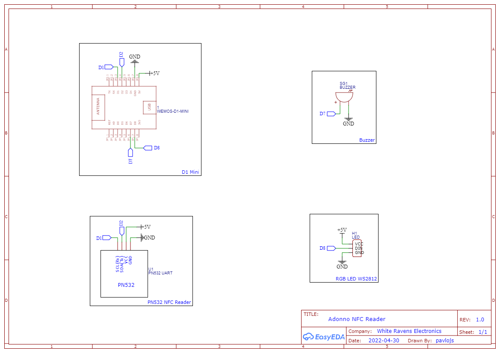

# Tag Reader PCB for Home Assistant
Custom PCB for original [adonno's tagreader](https://github.com/adonno/tagreader) specially created for [Home Assistant](https://www.home-assistant.io).

## Schematic & Preview

## Build & Usage
- Solder all [components](https://github.com/adonno/tagreader/blob/master/README.md#building-the-tag-reader) in place
- Follow instructions from [addono's GitHub repository](https://github.com/adonno/tagreader/blob/master/README.md#building-the-tag-reader)
- YouTube [Tutorial](https://www.youtube.com/watch?v=YqwRppUsFIQ)

There is a nice case prepared for use with this PCB.

## :sparkles: Credits
Many thanks to all [authors](https://github.com/adonno/tagreader/blob/master/AUTHORS.md) for this great [project](https://github.com/adonno/tagreader).

Thank you @user for a project of a case for this PCB.

## License
:key: [MIT License](LICENSE.md)
